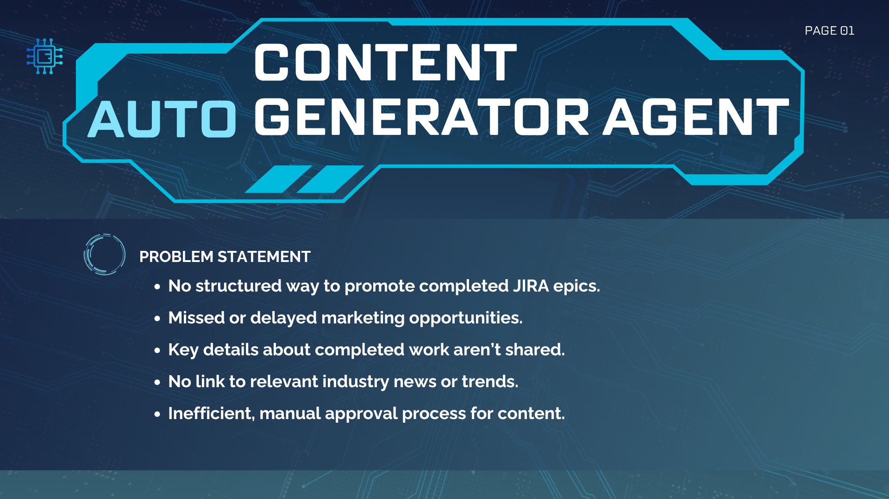
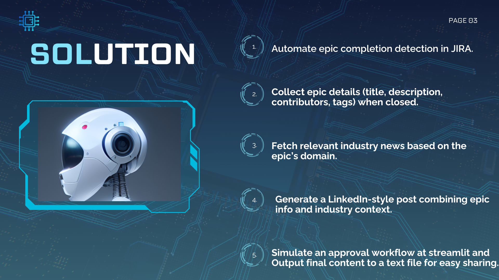
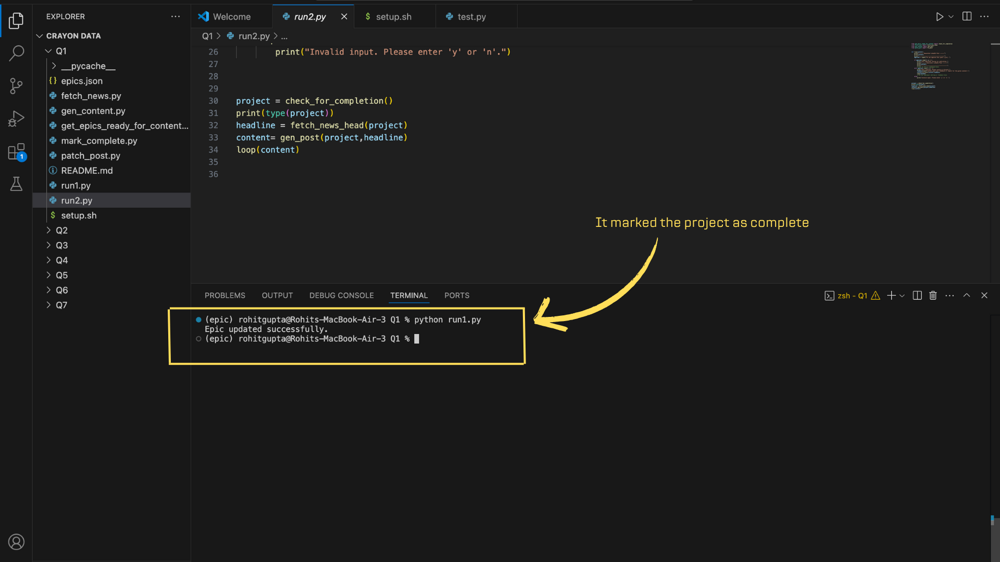
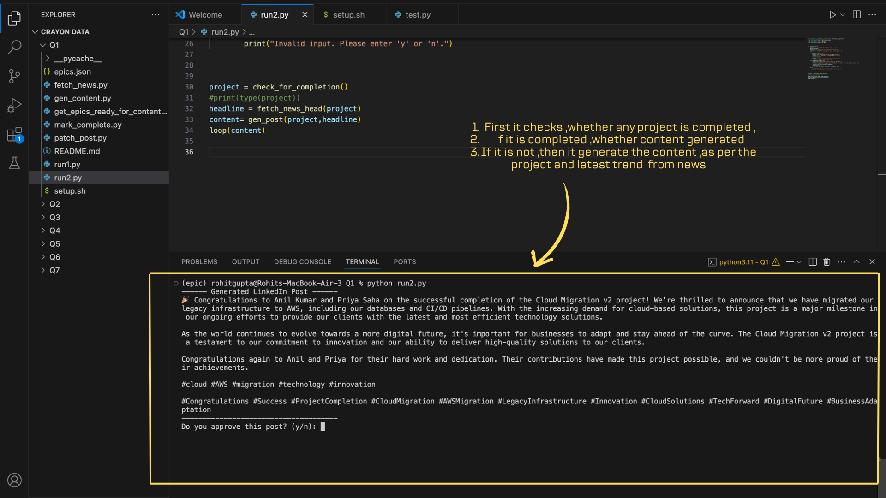
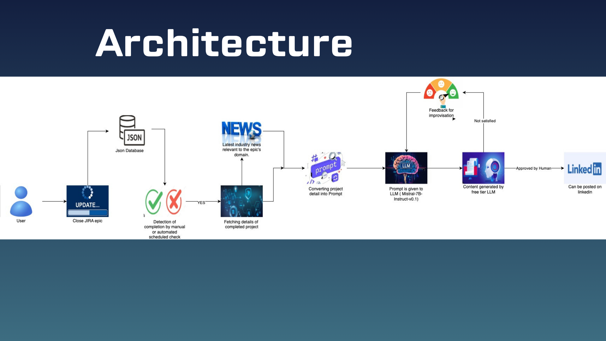
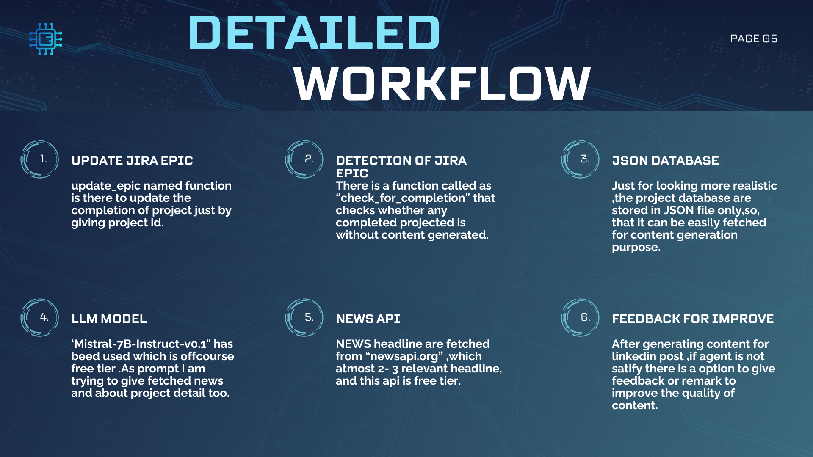

# 🚀 Auto Content Generator Agent

**Industry:** IT Services  
**Company:** TCS

---

## 📝 Problem Statement

Product and platform teams often close JIRA epics without a structured way to promote these accomplishments externally—leading to missed or delayed marketing opportunities.

---

## 🌟 Solution Highlights

This project **automates the process** of generating and sharing LinkedIn-style posts when a JIRA epic is closed, seamlessly integrating relevant industry news and an approval workflow.

---

## ⚙️ Features

- ✅ **Simulated Project Board** with epics
- ✅ **Auto-detection** of epic completion
- ✅ **Epic details extraction** (title, description, contributors, tags)
- ✅ **Relevant industry news fetching**
- ✅ **AI-powered LinkedIn-style post generation**
- ✅ **Command-line approval flow**
- ✅ **Outputs to text file or dashboard**

---

## 📦 Setup & Requirements

### 1. Install Dependencies

All dependencies are listed in `requirements.txt`.

```bash
pip install -r requirements.txt
````

### 2. Environment Variables

Set the following API keys before running the scripts:

```bash
export NEWS_API=<your_news_api_key>
export LLM_API=<your_llm_api_key>
```

* `NEWS_API`: API key for fetching industry news.
* `LLM_API`: API key for language model (AI) post generation.

---

## 🛠️ Usage Instructions

**Step 1:**
Run the following script to display projects that are finished but not yet posted:

```bash
python run1.py
```

**Step 2:**
Trigger the content generation and approval flow:

```bash
python run2.py
```

* All interactions will happen via the command line.
* Approve, edit, or reject the generated post directly from the terminal.

---

## 🖼️ Visual Workflow

Follow the steps visually for quick guidance:

<p align="center">
  
  
  <br>
  
  
  <br>
  
  
</p>

---

## 📁 File Structure

```
├── 1.png ~ 6.png          # Visual workflow images
├── requirements.txt       # Python dependencies
├── run1.py                # Shows unposted finished projects
├── run2.py                # Triggers post generation and approval
├── README.md              # This file!
```

---

## 🛡️ Notes

* Ensure that all image files (`1.png` to `6.png`) are in the project root for images to display correctly.
* The system is designed for command-line use only.


---

**Ready to accelerate your project’s visibility?
Start with `python run1.py` and the `python run2.py`

```
